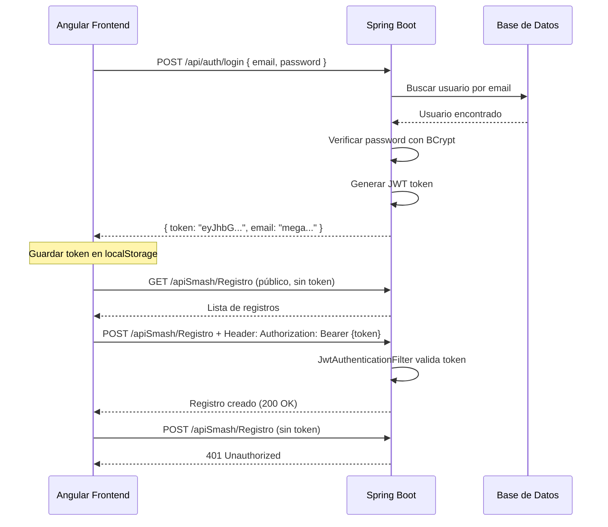

# Plan de Implementación: Autenticación con Spring Security + JWT

## Objetivo

Implementar un sistema de **autenticación sin registro** usando Spring Security y JWT (JSON Web Tokens). 
El objetivo es proteger los endpoints de escritura (POST, PUT, DELETE) mientras los de lectura (GET) permanecen públicos.

> [!IMPORTANT]
> **NO habrá flujo de registro.** Solo existirá un usuario admin precargado en la base de datos.

---

## Credenciales del Usuario Admin

| Campo    | Valor                       |
|----------|------------------------------|
| Email    | `megawhitegengar@gmail.com`  |
| Password | `Secreta655%` (BCrypt hash)  |
| Rol      | `ADMIN`                      |

---

## Arquitectura Propuesta

```
┌────────────────────────────────────────────────────────────────────────────┐
│                              FRONTEND (Angular)                            │
├────────────────────────────────────────────────────────────────────────────┤
│  LoginComponent  │  AuthService  │  AuthGuard  │  HttpInterceptor         │
└────────────────────────────────────────────────────────────────────────────┘
                                    │
                                    ▼
┌────────────────────────────────────────────────────────────────────────────┐
│                            BACKEND (Spring Boot)                           │
├────────────────────────────────────────────────────────────────────────────┤
│                                                                            │
│   📁 auth/                                                                 │
│   ├── config/                                                              │
│   │   ├── SecurityConfig.java          ← Configuración de Spring Security │
│   │   └── JwtAuthenticationFilter.java ← Filtro para validar JWT          │
│   ├── controller/                                                          │
│   │   └── AuthController.java          ← POST /api/auth/login              │
│   ├── service/                                                             │
│   │   ├── AuthService.java             ← Lógica de autenticación          │
│   │   ├── JwtService.java              ← Generación/validación de tokens  │
│   │   └── CustomUserDetailsService.java ← Carga el usuario desde DB       │
│   ├── dto/                                                                 │
│   │   ├── LoginRequestDTO.java         ← { email, password }              │
│   │   └── LoginResponseDTO.java        ← { token, email }                 │
│   └── entity/                                                              │
│       └── Usuario.java                 ← Entidad JPA para usuarios        │
│                                                                            │
└────────────────────────────────────────────────────────────────────────────┘
```

---

## Dependencias a Agregar en `pom.xml`

```xml
<!-- Spring Security -->
<dependency>
    <groupId>org.springframework.boot</groupId>
    <artifactId>spring-boot-starter-security</artifactId>
</dependency>

<!-- JWT (Java JWT de Auth0) -->
<dependency>
    <groupId>io.jsonwebtoken</groupId>
    <artifactId>jjwt-api</artifactId>
    <version>0.12.3</version>
</dependency>
<dependency>
    <groupId>io.jsonwebtoken</groupId>
    <artifactId>jjwt-impl</artifactId>
    <version>0.12.3</version>
    <scope>runtime</scope>
</dependency>
<dependency>
    <groupId>io.jsonwebtoken</groupId>
    <artifactId>jjwt-jackson</artifactId>
    <version>0.12.3</version>
    <scope>runtime</scope>
</dependency>
```

---

## Base de Datos: Tabla `usuarios`

```sql
CREATE TABLE usuarios (
    id BIGINT PRIMARY KEY AUTO_INCREMENT,
    email VARCHAR(255) NOT NULL UNIQUE,
    password VARCHAR(255) NOT NULL,  -- BCrypt hash
    rol VARCHAR(50) NOT NULL DEFAULT 'ADMIN'
);

-- Insertar el usuario admin (password hasheado con BCrypt)
-- La contraseña "Secreta655%" se hashea antes de insertar
INSERT INTO usuarios (email, password, rol) VALUES (
    'megawhitegengar@gmail.com',
    '$2a$10$HASH_GENERADO_POR_BCRYPT',  -- Hay que generar este hash
    'ADMIN'
);
```

> [!TIP]
> Para generar el hash BCrypt de la contraseña, puedes usar:
> - Online: https://bcrypt-generator.com/
> - O ejecutar en Java: `new BCryptPasswordEncoder().encode("Secreta655%")`

---

## Flujo de Autenticación



---

## Configuración de Endpoints

| Método | Endpoint                | Requiere Auth | Descripción                  |
|--------|-------------------------|---------------|------------------------------|
| POST   | `/api/auth/login`       | ❌ No         | Login, devuelve JWT          |
| GET    | `/apiSmash/*`           | ❌ No         | Todos los GET son públicos   |
| POST   | `/apiSmash/Registro`    | ✅ Sí         | Crear registro               |
| PUT    | `/apiSmash/Registro`    | ✅ Sí         | Actualizar registro          |
| DELETE | `/apiSmash/Registro/*`  | ✅ Sí         | Eliminar registro            |

---

## Implementación por Etapas

### Etapa 1: Backend - Estructura Base
1. Agregar dependencias en `pom.xml`
2. Crear entidad `Usuario.java`
3. Crear repositorio `UsuarioRepository.java`
4. Insertar usuario admin en la base de datos

### Etapa 2: Backend - Servicios JWT
1. Crear `JwtService.java` (generar y validar tokens)
2. Agregar propiedades JWT en `application.properties`:
   ```properties
   jwt.secret=TU_CLAVE_SECRETA_MUY_LARGA_MINIMO_256_BITS
   jwt.expiration=86400000  # 24 horas en millisegundos
   ```

### Etapa 3: Backend - Spring Security Config
1. Crear `CustomUserDetailsService.java`
2. Crear `JwtAuthenticationFilter.java`
3. Crear `SecurityConfig.java` con:
   - Deshabilitar CSRF (para APIs REST)
   - Configurar CORS
   - Definir qué endpoints son públicos y cuáles protegidos
   - Agregar el filtro JWT

### Etapa 4: Backend - Endpoint de Login
1. Crear `LoginRequestDTO.java` y `LoginResponseDTO.java`
2. Crear `AuthService.java`
3. Crear `AuthController.java` con endpoint `/api/auth/login`

### Etapa 5: Frontend Angular - Service y Componentes
1. Crear `AuthService` en Angular para:
   - Llamar al endpoint de login
   - Guardar/recuperar token de localStorage
   - Verificar si está logueado
2. Crear `LoginComponent` con formulario email/password
3. Crear `HttpInterceptor` para agregar token a requests protegidos

### Etapa 6: Frontend Angular - Protección de Rutas
1. Crear `AuthGuard` para proteger rutas que requieren login
2. Actualizar los componentes que hacen POST/PUT/DELETE para manejar errores 401

---

## Estructura de Carpetas Final

### Backend (`smashnotes_springboot_back`)

```
src/main/java/smashnotest_back/
├── auth/
│   ├── config/
│   │   ├── SecurityConfig.java
│   │   └── JwtAuthenticationFilter.java
│   ├── controller/
│   │   └── AuthController.java
│   ├── service/
│   │   ├── AuthService.java
│   │   ├── JwtService.java
│   │   └── CustomUserDetailsService.java
│   ├── dto/
│   │   ├── LoginRequestDTO.java
│   │   └── LoginResponseDTO.java
│   ├── entity/
│   │   └── Usuario.java
│   └── repository/
│       └── UsuarioRepository.java
├── configs/
├── matchups/
├── SmashnotestBackApplication.java
└── SmashnotestBackController.java
```

### Frontend (`smashnotes_angular`)

```
src/app/
├── authentication/
│   ├── components/
│   │   └── login/
│   │       ├── login.component.ts
│   │       ├── login.component.html
│   │       └── login.component.css
│   ├── services/
│   │   └── auth.service.ts
│   ├── guards/
│   │   └── auth.guard.ts
│   └── interceptors/
│       └── auth.interceptor.ts
├── matchups/
├── btn-backup/
└── toolbar/
```

---

## Consideraciones de Seguridad

> [!WARNING]
> **Importante para producción:**
> - El `jwt.secret` debe estar en variables de entorno, NO en el código
> - El token JWT debe tener tiempo de expiración razonable (24h sugerido)
> - Considerar implementar refresh tokens para mayor seguridad
> - La contraseña NUNCA debe guardarse en texto plano

---

## Opciones Alternativas (Simplificación)

Si lo anterior te parece muy complejo, hay opciones más simples:

### Opción A: Basic Auth (Más Simple, Menos Seguro)
- No usa JWT, solo credenciales en cada request
- Angular envía `Authorization: Basic base64(email:password)` en cada request
- Más simple pero menos seguro (credenciales viajan en cada petición)

### Opción B: Session-Based Auth
- Usa sesiones de Spring Security tradicionales
- Más simple de implementar pero no ideal para SPAs

### Opción C: Hardcoded Password Check (MUY Simple, No Recomendado para Producción)
- Un endpoint simple que verifica las credenciales hardcodeadas
- Devuelve un token simple que se almacena en Angular
- Sin base de datos para usuarios

---

## ¿Qué opción prefieres?

1. **Opción Completa (JWT)**: La más robusta y escalable, ideal si en el futuro quisieras agregar más usuarios o roles.
2. **Opción Básica**: Menos código, funciona pero menos segura.
3. **Opción Hardcoded**: La más rápida de implementar, solo para uso personal/desarrollo.

---

## Próximos Pasos

1. **Elige la opción de implementación** que prefieras
2. **Yo puedo implementar el código** paso a paso
3. Probar el flujo completo local → deploy

¿Con cuál opción quieres que procedamos? 🚀
